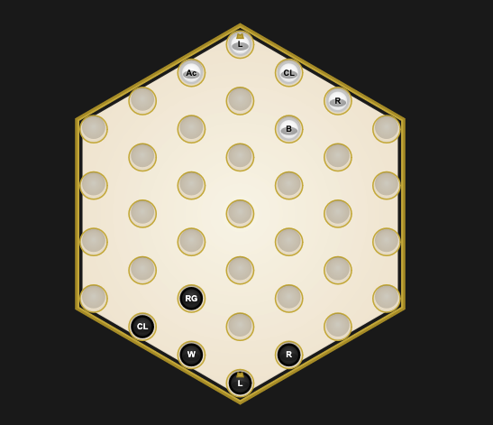

# Leaders

## OVERVIEW

This repository contains a web-based UI for completing puzzles from the game Leaders. The engine supports a hexagonal board, turn-based gameplay, and a character class system for implementing unique piece abilities.

## VICTORY

A team wins immediately when their opponent's Leader is either **captured** (adjacent to 2+ enemy pieces) or **surrounded** (has no valid moves available). Victory conditions are checked after each move and are implemented in the `Leader` class.

## BOARD AND NOTATION

The board uses a **LETTERNUMBER** coordinate system where letters (A-G) represent columns (left to right) and numbers (1-7) represent rows (bottom to top). You can reset the board to any puzzle state by pasting notation into the input field at the top of the page. Notation format: `White: {L:D7, B:E7}; Black: {L:D1, B:E1}`

## CHARACTERS

Each piece displays its class acronym (e.g., "L" for Leader, "B" for Bruiser) as a large letter on the piece. Character classes are located in `src/engine/characters/` - each class extends the `Piece` base class and implements `getAcronym()` and `useAbility()` methods.

## TODOS

* Implement individual character classes:
    [x] Acrobat
    [X] Archer
    [x] Assassin
    [x] Brewmaster
    [x] Bruiser
    [x] Claw Launcher
    [] Hermit & Cub
    [x] Illusionist
    [X] Jailer
    [x] Leader
    [x] Manipulator
    [] Nemesis
    [X] Protector
    [x] Rider
    [x] Royal Guard
    [X] Vizier
    [x] Wanderer
* Prevent user from taking an illegal move
* Allow user to copy the notation to their solution to the puzzle when they end their turn or win
* Implement non-dev graphics